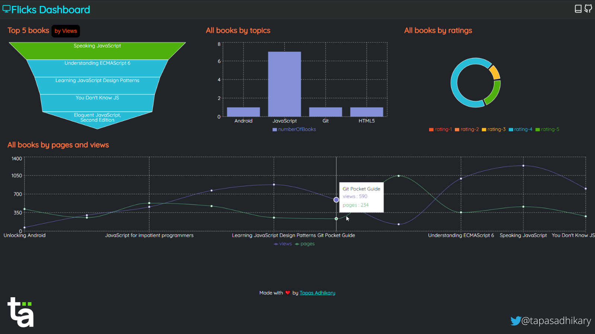

# flicks-admin
A project to showcase HarperDB Custom function with Recharts to create a simple dashboard.

    <a href="https://flicks-admin.vercel.app/" target="_blank"> See Demo</a>

    

## 🍔 Built With
- [HarperDB](https://harperdb.io/)
- [HarperDB Custom Functions](https://harperdb.io/docs/custom-functions/)
- [React](https://reactjs.org/)
- [Recharts](https://recharts.org/en-US/)
- [React-Feather](https://www.npmjs.com/package/react-feather)
- [A Curious Mind](https://tapasadhikary.com)

## 🚀 Deployed On Vercel
- [Check the deployed app](https://flicks-admin.vercel.app/)

## 🤲 Want to Motivate?
Who doesn't need motivation? Please give the project a star(⭐) and/or share it in your dev circle.

## 🏃‍♀️ Run It Locally
Check this [Readme file](app/README.md) for more information about how to run the application locally.

